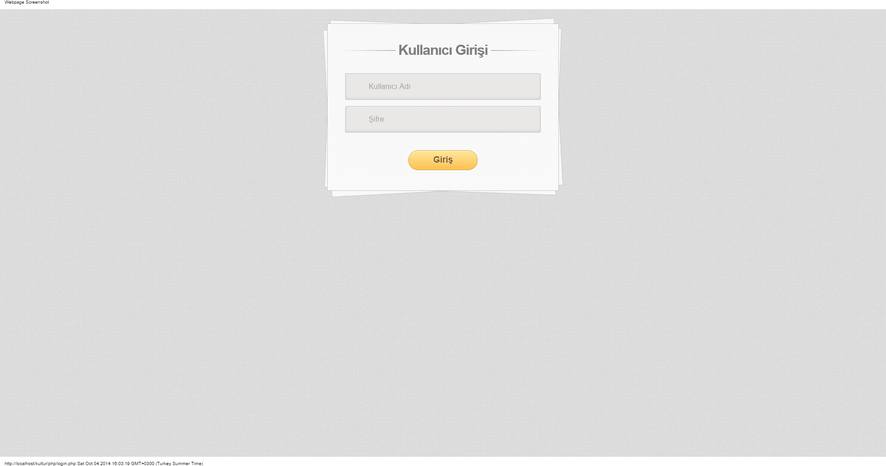
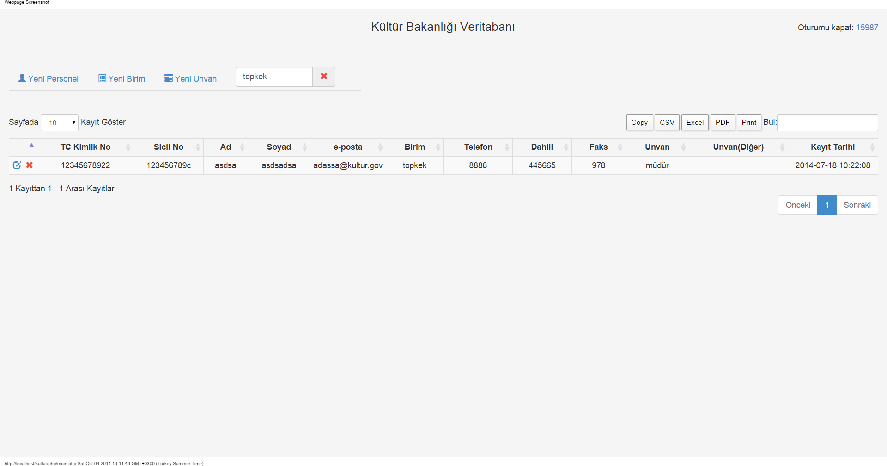
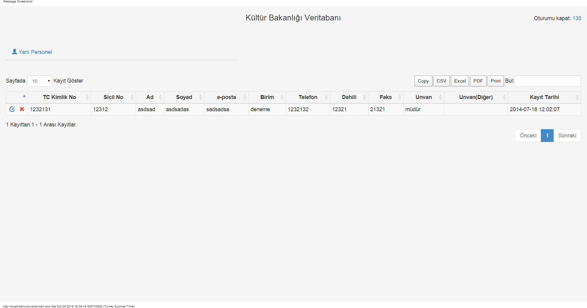
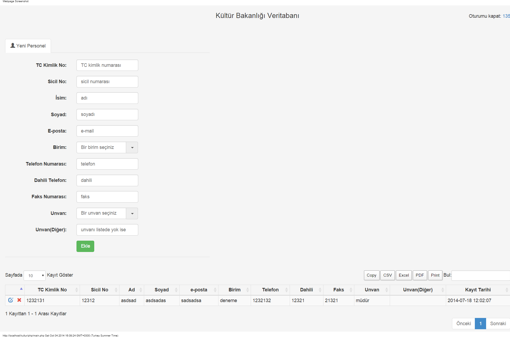
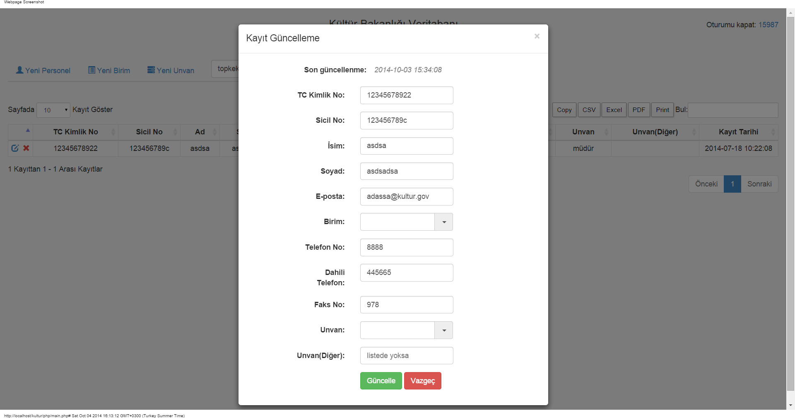
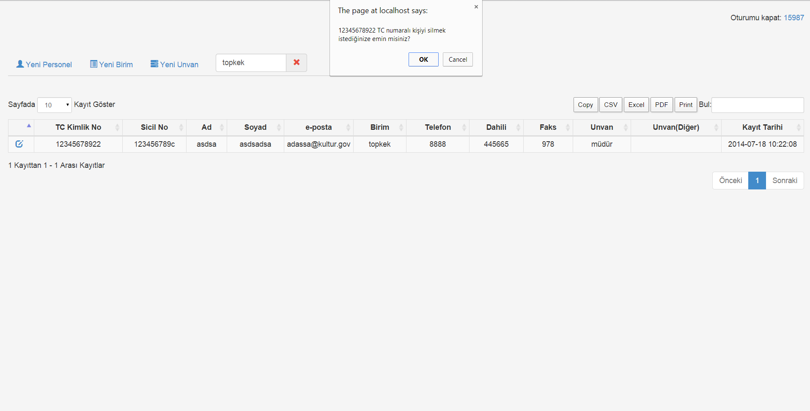

This is an Internship project that I had been tasked to do by the Ministry of Tourism and Culture. 

It is an personnel information system for which I have implemented both the front end and the back end in about a few weeks so I know there are some bad practices in there.

I have used Xampp to run it locally and you can find the database schema(and maybe some entries) in the file "staj.sql".

Here are some screenshots:

Login Page
------

Admin Main Page
------

Non-Admin Main Page
------

Add Personnel
------

Edit Personnel
------

Delete Personnel
------

Apart from these, the admin can create new titles and personnel units. The written details of the system can be found in the "description of the work done" section
of my report [here](https://drive.google.com/open?id=0B5i7VpQV6B9VMi1lbTQ2aFMwTWc).